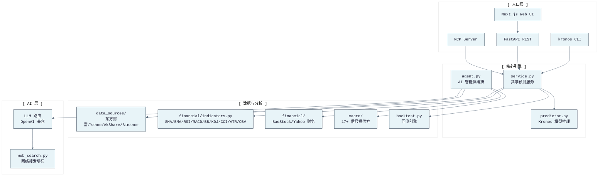

# KronosFinceptLab

> 本地优先的量化金融分析驾驶舱  
> 版本：10.9.0 | Python >= 3.11 | Node >= 18

---

## 简介

KronosFinceptLab 是一个**本地优先的量化金融分析平台**，完全在本地运行。集市场行情数据获取、AI K线预测、技术分析、宏观经济信号聚合、投研分析、策略回测于一体，支持 CLI、REST API、Web UI 和 MCP 四种入口。

所有核心能力无需云端锁定即可工作。外部数据源（东方财富、Tushare、Yahoo、Binance）和 LLM 服务均为可选，失败时自动降级。

---

## 快速开始

```bash
# 安装
pip install -e ".[api,cli,astock,kronos]"

# CLI 预测
kronos forecast --symbol 600036 --pred-len 5

# 启动 API + Web
kronos serve --host 0.0.0.0 --port 8000
cd web && npm install && npm run dev
```

- Web UI：http://localhost:3000
- API：http://localhost:8000
- API 文档：http://localhost:8000/docs（需设置 `KRONOS_ENABLE_API_DOCS=1`）

---

## 能力矩阵

| 能力 | CLI | API | Web | MCP |
|---|---|---|---|---|
| K线预测 | `kronos forecast` | `POST /api/forecast` | 预测页面 | `forecast_ohlcv` |
| 批量排名 | `kronos batch` | `POST /api/batch` | 批量页面 | `batch_forecast_ohlcv` |
| 行情数据 | `kronos data fetch` | `GET /api/data/*` | 数据页面 | `fetch_a_stock` |
| 技术指标 | `kronos data indicator` | `GET /api/data/indicator/*` | 数据页面 | `calculate_indicators` |
| AI 智能体分析 | `kronos analyze agent` | `POST /api/v1/analyze/agent` | 分析页面 | `analyze_agent` |
| 宏观分析 | `kronos analyze macro` | `POST /api/v1/analyze/macro` | 宏观页面 | `analyze_macro` |
| AI 个股报告 | `kronos analyze ai-analyze` | `POST /api/v1/analyze/ai` | 分析页面 | `analyze_ai` |
| DCF/风险/组合 | `kronos analyze dcf` | `POST /api/v1/analyze/dcf` | 分析页面 | `analyze_dcf` 等 |
| 策略回测 | `kronos backtest ranking` | `POST /api/backtest/ranking` | 回测页面 | `run_ranking_backtest` |
| 策略实验室 | `kronos backtest strategy` | `POST /api/backtest/strategy` | 回测页面 | `run_strategy_backtest` |
| 智能预警 | `kronos alert add` | `POST /api/alert/rules` | 预警页面 | `create_prediction_deviation_alerts` |
| 新闻/RSS | `kronos news rss` | `POST /api/news/rss` | 新闻页面 | `fetch_rss_news` |
| 自选研究 | `kronos watchlist` | `GET/POST /api/watchlist/*` | 自选页面 | `watchlist_research` |
| 异步任务 | `kronos jobs` | `POST/GET /api/jobs/*` | 任务面板 | `submit_backtest_job` |
| 健康检查 | `kronos health` | `GET /api/health` | 仪表盘 | `health_check` |

---

## 架构概览



> 完整架构说明见 [docs/ARCHITECTURE.md](docs/ARCHITECTURE.md)

---

## 项目结构

```
KronosFinceptLab/
├── src/kronos_fincept/          # Python 后端
│   ├── api/                     # FastAPI 路由、安全、中间件
│   ├── cli/                     # Click CLI 命令
│   ├── data_sources/            # 行情数据适配器（东方财富、Yahoo 等）
│   ├── financial/               # 财务报表（BaoStock、Yahoo）
│   ├── macro/                   # 宏观数据提供方（17+ 信号类型）
│   ├── agent.py                 # AI 智能体编排
│   ├── service.py               # 共享预测服务
│   ├── predictor.py             # Kronos 模型推理
│   ├── alert_engine.py          # 规则预警引擎
│   ├── backtest_report.py       # HTML 报告生成
│   ├── config.py                # 配置管理
│   ├── logging_config.py        # 结构化 JSON 日志
│   └── security_utils.py        # SSRF 安全 URL 校验
├── web/                         # Next.js 前端
│   ├── src/app/                 # 页面（仪表盘、预测、分析等）
│   ├── src/components/          # React 组件
│   ├── src/lib/                 # API 客户端、Query Key、工具
│   └── src/stores/              # 状态管理
├── kronos_mcp/                  # MCP 服务实现
├── tests/                       # 70+ 测试模块
├── docs/                        # 文档
│   ├── ARCHITECTURE.md          # 系统架构与数据流
│   ├── API.md                   # REST 接口参考
│   ├── CLI.md                   # CLI 命令参考
│   ├── DEPLOYMENT.md            # 本地与 Docker 部署
│   ├── START_GUIDE.md           # 快速启动指南
│   └── FINCEPT_INTEGRATION.md   # FinceptTerminal 集成
├── examples/                    # 使用示例
├── integrations/                # 外部集成（FinceptTerminal）
└── scripts/                     # 工具脚本
```

---

## 文档导航

| 文档 | 内容 |
|---|---|
| [docs/ARCHITECTURE.md](docs/ARCHITECTURE.md) | 系统架构、模块边界、数据流、安全模型 |
| [docs/API.md](docs/API.md) | REST 接口清单、认证、请求/响应结构 |
| [docs/CLI.md](docs/CLI.md) | CLI 命令树、参数、示例 |
| [docs/DEPLOYMENT.md](docs/DEPLOYMENT.md) | 本地、Docker、Zeabur 部署 |
| [docs/START_GUIDE.md](docs/START_GUIDE.md) | 逐步首次运行指南 |
| [docs/FINCEPT_INTEGRATION.md](docs/FINCEPT_INTEGRATION.md) | FinceptTerminal C++/Python 桥接 |
| [kronos_mcp/README.md](kronos_mcp/README.md) | MCP 服务工具与客户端配置 |

---

## 质量门禁

```bash
# 后端
python -m pytest tests -q

# 前端
cd web && npm run typecheck && npm run lint && npm run test:frontend
```

---

## 环境要求

- **Python**：>= 3.11
- **Node.js**：>= 18（本地前端）；Docker 使用 Node 22

---

> 所有预测和分析仅供研究用途，不构成投资建议。

---

**上游项目**：[Kronos](https://github.com/shiyu-coder/Kronos) · [FinceptTerminal](https://github.com/Fincept-Corporation/FinceptTerminal) · [Digital Oracle](https://github.com/komako-workshop/digital-oracle)
