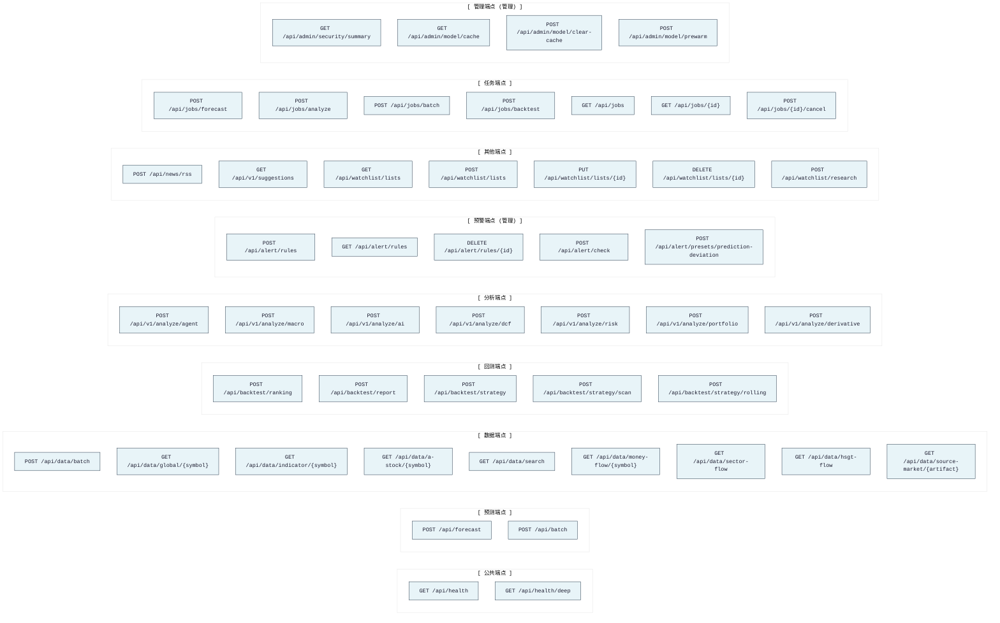
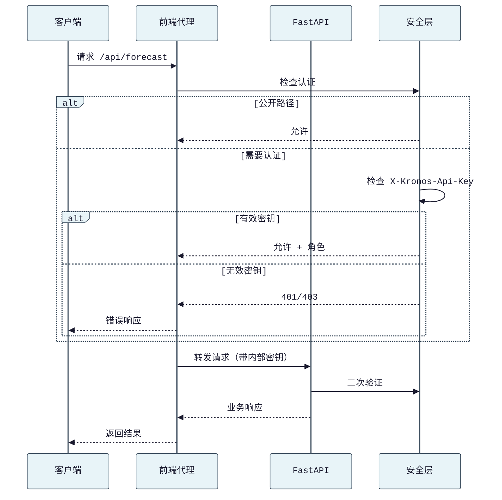
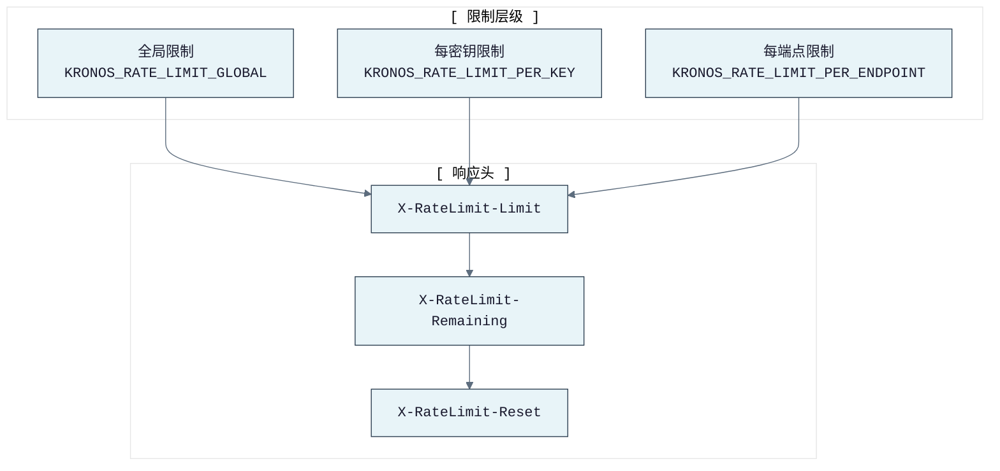

# KronosFinceptLab API 接口文档

> 本文档描述所有 REST 端点、认证机制、请求/响应格式。

---

## 导航

- [← 返回 README](../README.md)
- [← 架构文档](ARCHITECTURE.md)
- [→ CLI 命令文档](CLI.md)
- [→ 部署指南](DEPLOYMENT.md)

---

## 基础信息

- **基础 URL**: `http://localhost:8000`
- **API 前缀**: `/api`
- **认证**: 大多数 `/api/*` 端点需要 API 密钥（除非 `KRONOS_AUTH_DISABLED=1`）
- **认证方式**:
  - Header: `X-Kronos-Api-Key: <key>`
  - Header: `Authorization: Bearer <key>`
- **管理端点**: 预警和管理诊断需要管理密钥（`KRONOS_ADMIN_API_KEYS` 或 `KRONOS_INTERNAL_API_KEY`）

---

## 端点总览



---

## 端点清单

| 领域 | 方法 | 路径 | 说明 | 认证 |
|------|------|------|------|------|
| 健康 | GET | `/api/health` | 存活检查与模型/构建元数据 | 公开 |
| 健康 | GET | `/api/health/deep` | 深度依赖健康信息 | 公开 |
| 预测 | POST | `/api/forecast` | 单资产 Kronos 预测 | 用户密钥 |
| 批量 | POST | `/api/batch` | 多资产预测与排名 | 用户密钥 |
| 数据 | POST | `/api/data/batch` | 多代码 OHLCV 获取（含每代码错误） | 用户密钥 |
| 数据 | GET | `/api/data/global/{symbol}` | 全球市场 OHLCV 数据 | 用户密钥 |
| 数据 | GET | `/api/data/indicator/{symbol}` | 技术指标 | 用户密钥 |
| 数据 | GET | `/api/data/a-stock/{symbol}` | A股 OHLCV 数据 | 用户密钥 |
| 数据 | GET | `/api/data/search` | 股票/品种搜索 | 用户密钥 |
| 数据 | GET | `/api/data/money-flow/{symbol}` | 东方财富主力资金流 | 用户密钥 |
| 数据 | GET | `/api/data/sector-flow` | 东方财富板块/概念资金流排名 | 用户密钥 |
| 数据 | GET | `/api/data/hsgt-flow` | 港股通资金流（需 Tushare） | 用户密钥 |
| 数据 | GET | `/api/data/source-market/{artifact}` | 源项目市场回顾缓存 | 用户密钥 |
| 回测 | POST | `/api/backtest/ranking` | 多代码排名回测 | 用户密钥 |
| 回测 | POST | `/api/backtest/report` | HTML/文本报告生成 | 用户密钥 |
| 回测 | POST | `/api/backtest/strategy` | 多策略组合比较 | 用户密钥 |
| 回测 | POST | `/api/backtest/strategy/scan` | 策略参数扫描 | 用户密钥 |
| 回测 | POST | `/api/backtest/strategy/rolling` | 滚动验证 | 用户密钥 |
| 分析 | POST | `/api/v1/analyze/agent` | 自然语言无状态分析智能体 | 用户密钥 |
| 分析 | POST | `/api/v1/analyze/macro` | 宏观与跨市场信号分析 | 用户密钥 |
| 分析 | POST | `/api/v1/analyze/ai` | AI 个股分析报告 | 用户密钥 |
| 分析 | POST | `/api/v1/analyze/dcf` | DCF 估值 | 用户密钥 |
| 分析 | POST | `/api/v1/analyze/risk` | 风险指标 | 用户密钥 |
| 分析 | POST | `/api/v1/analyze/portfolio` | 组合优化 | 用户密钥 |
| 分析 | POST | `/api/v1/analyze/derivative` | 期权定价 | 用户密钥 |
| 预警 | POST | `/api/alert/rules` | 创建预警规则 | 管理密钥 |
| 预警 | GET | `/api/alert/rules` | 列出预警规则 | 管理密钥 |
| 预警 | DELETE | `/api/alert/rules/{rule_id}` | 删除预警规则 | 管理密钥 |
| 预警 | POST | `/api/alert/check` | 运行预警检查 | 管理密钥 |
| 预警 | POST | `/api/alert/presets/prediction-deviation` | 创建预测偏差预设 | 管理密钥 |
| 新闻 | POST | `/api/news/rss` | 获取 HTTPS RSS/Atom（SSRF 安全 URL 检查） | 用户密钥 |
| 建议 | GET | `/api/v1/suggestions` | 分析或宏观提示建议 | 用户密钥 |
| 自选 | GET | `/api/watchlist/lists` | 列出持久化自选 | 用户密钥 |
| 自选 | POST | `/api/watchlist/lists` | 创建自选 | 用户密钥 |
| 自选 | PUT | `/api/watchlist/lists/{watchlist_id}` | 更新自选 | 用户密钥 |
| 自选 | DELETE | `/api/watchlist/lists/{watchlist_id}` | 删除自选 | 用户密钥 |
| 自选 | POST | `/api/watchlist/research` | 构建加权自选研究摘要 | 用户密钥 |
| 任务 | POST | `/api/jobs/forecast` | 提交异步预测任务 | 用户密钥 |
| 任务 | POST | `/api/jobs/analyze` | 提交异步分析任务 | 用户密钥 |
| 任务 | POST | `/api/jobs/batch` | 提交异步批量任务 | 用户密钥 |
| 任务 | POST | `/api/jobs/backtest` | 提交异步回测任务 | 用户密钥 |
| 任务 | GET | `/api/jobs` | 列出有界进程内任务历史 | 用户密钥 |
| 任务 | GET | `/api/jobs/{job_id}` | 读取异步任务状态/结果 | 用户密钥 |
| 任务 | POST | `/api/jobs/{job_id}/cancel` | 取消排队/运行中任务 | 用户密钥 |
| 管理 | GET | `/api/admin/security/summary` | 安全配置摘要 | 管理密钥 |
| 管理 | GET | `/api/admin/model/cache` | 模型缓存状态 | 管理密钥 |
| 管理 | POST | `/api/admin/model/clear-cache` | 清除模型缓存 | 管理密钥 |
| 管理 | POST | `/api/admin/model/prewarm` | 预加载模型 | 管理密钥 |

---

## 认证流程



---

## 请求/响应格式

### 标准响应结构

```json
{
  "ok": true,
  "data": { ... },
  "error": null,
  "request_id": "uuid",
  "timestamp": 1234567890
}
```

### 错误响应结构

```json
{
  "ok": false,
  "error": "错误描述",
  "type": "error_type",
  "request_id": "uuid"
}
```

---

## 接口详情

### 健康检查

```http
GET /api/health
```

返回模型/构建/运行时元数据：状态、版本、支持的模型 ID、模型加载状态、设备、运行时间、请求追踪字段。

**响应示例**:

```json
{
  "ok": true,
  "status": "healthy",
  "version": "10.9.0",
  "model_id": "NeoQuasar/Kronos-base",
  "model_loaded": true,
  "device": "cuda",
  "uptime_seconds": 3600,
  "request_id": "req-123"
}
```

---

### 单资产预测

```http
POST /api/forecast
Content-Type: application/json

{
  "symbol": "600036",
  "timeframe": "1d",
  "pred_len": 5,
  "rows": [
    { "timestamp": "2026-01-02T00:00:00Z", "open": 100, "high": 101, "low": 99, "close": 100.5, "volume": 1000000 }
  ],
  "dry_run": false,
  "model_id": "NeoQuasar/Kronos-base",
  "sample_count": 1
}
```

支持模型族：`NeoQuasar/Kronos-mini`、`NeoQuasar/Kronos-small`、`NeoQuasar/Kronos-base`。

预测响应包含预测行和元数据：后端、耗时、缓存键、模型缓存状态。当 `sample_count > 1` 时返回概率字段（上涨概率、预测区间）。

**响应示例**:

```json
{
  "ok": true,
  "symbol": "600036",
  "timeframe": "1d",
  "model_id": "NeoQuasar/Kronos-base",
  "pred_len": 5,
  "forecast": [
    { "timestamp": "2026-01-03T00:00:00Z", "open": 100.5, "high": 102, "low": 99.5, "close": 101.2, "volume": 1050000 }
  ],
  "probabilistic": {
    "upside_probability": 0.65,
    "forecast_range": [98.5, 104.0]
  },
  "metadata": {
    "device": "cuda",
    "elapsed_ms": 1200,
    "backend": "kronos",
    "cache_key": "600036_1d_5_...",
    "model_cached": true
  }
}
```

---

### 批量预测

```http
POST /api/batch
Content-Type: application/json

{
  "assets": [
    {
      "symbol": "600036",
      "rows": [ ... ]
    },
    {
      "symbol": "000858",
      "rows": [ ... ]
    }
  ],
  "pred_len": 5,
  "dry_run": false
}
```

返回按预测收益排序的排名列表。

---

### 技术指标

```http
GET /api/data/indicator/{symbol}?market=cn&indicator=rsi
```

支持指标：`sma`、`ema`、`rsi`、`macd`、`bollinger`、`kdj`、`cci`、`atr`、`obv`。

---

### 预警规则

```http
POST /api/alert/rules
Content-Type: application/json
X-Kronos-Api-Key: admin-key

{
  "type": "price_change",
  "symbol": "600036",
  "threshold": 3.0,
  "notify": {
    "webhook": "https://example.com/webhook"
  }
}
```

支持预警类型：`price_change`、`price_above`、`price_below`、`rsi_overbought`、`rsi_oversold`、`macd_crossover`、`prediction_deviation`、`volume_spike`。

---

### 异步任务

```http
POST /api/jobs/forecast
Content-Type: application/json

{
  "symbol": "600036",
  "pred_len": 5
}
```

**响应**:

```json
{
  "ok": true,
  "job_id": "job-uuid",
  "status": "queued"
}
```

查询任务:

```http
GET /api/jobs/{job_id}
```

**响应**:

```json
{
  "ok": true,
  "job_id": "job-uuid",
  "status": "completed",
  "result": { ... },
  "progress": {
    "current": 5,
    "total": 5
  }
}
```

---

## 速率限制



---

## 前端 API 客户端

前端使用 `web/src/lib/api.ts` 中的类型安全客户端：

```typescript
import { api } from "@/lib/api";

// 预测
const result = await api.forecast({
  symbol: "600036",
  predLen: 5,
  rows: ohlcvData,
});

// 批量
const batch = await api.batch([{ symbol: "600036", rows: data1 }], 5);

// 回测
const backtest = await api.backtest({
  symbols: ["600036", "000858"],
  start_date: "20250101",
  end_date: "20260430",
  top_k: 1,
});
```

---

## 导航

- [← 返回 README](../README.md)
- [← 架构文档](ARCHITECTURE.md)
- [→ CLI 命令文档](CLI.md)
- [→ 部署指南](DEPLOYMENT.md)
