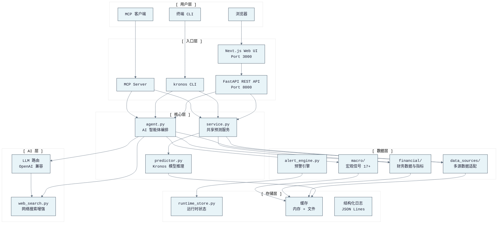
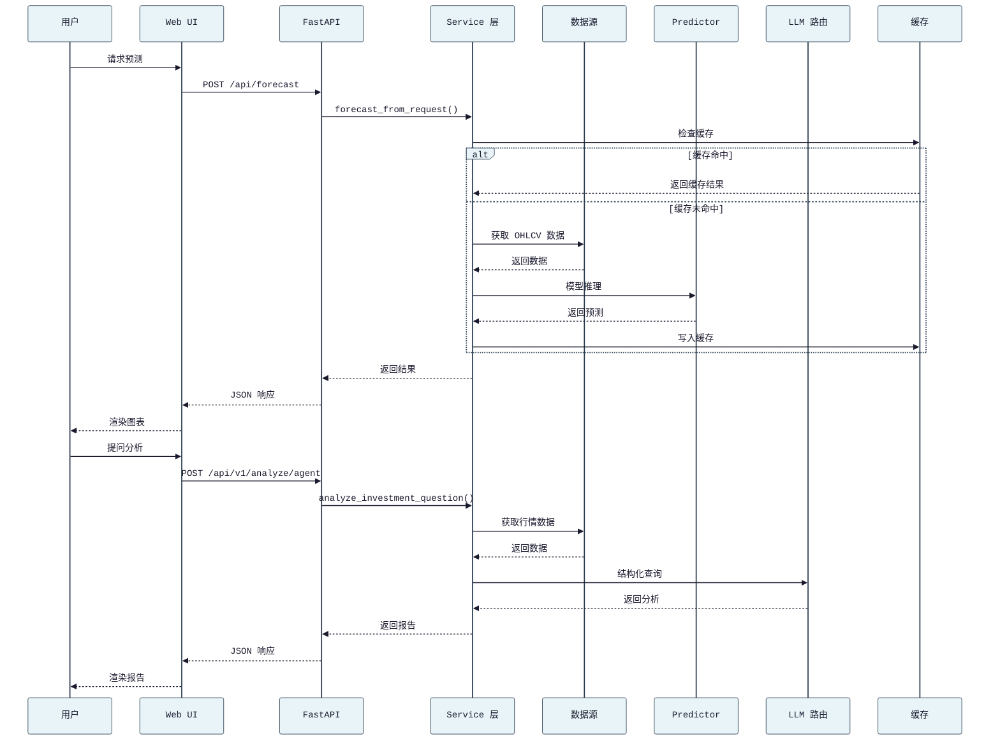
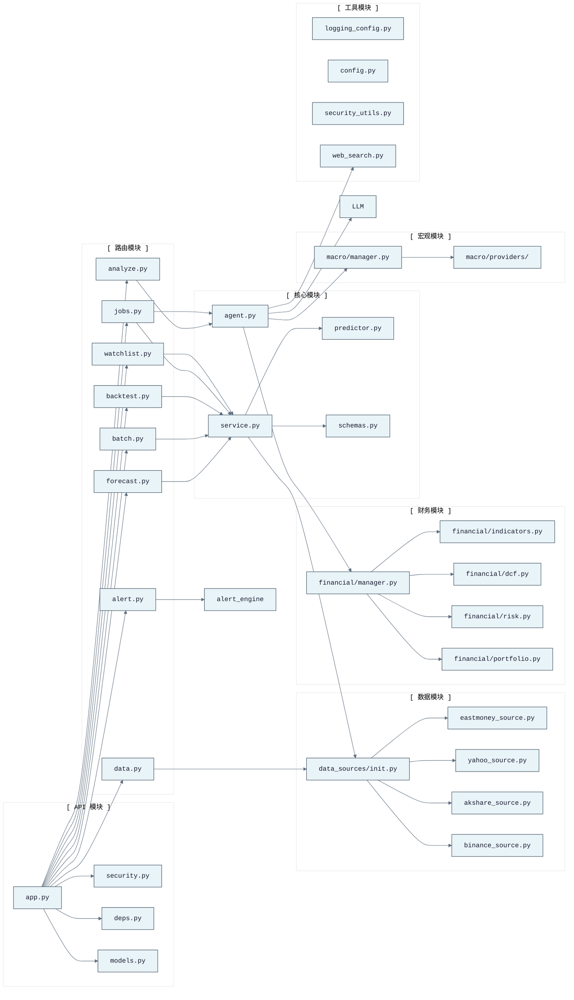
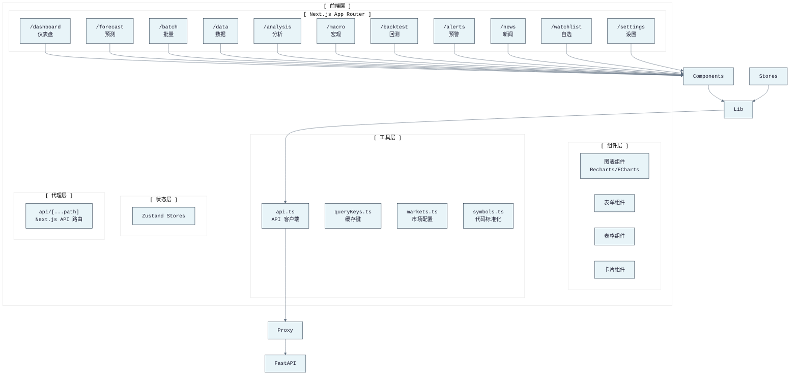
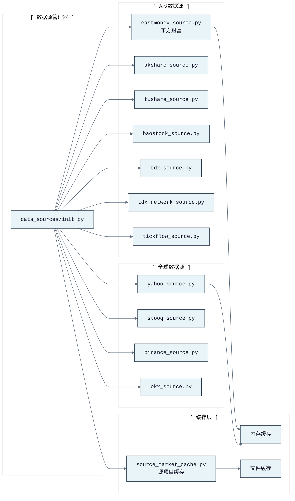
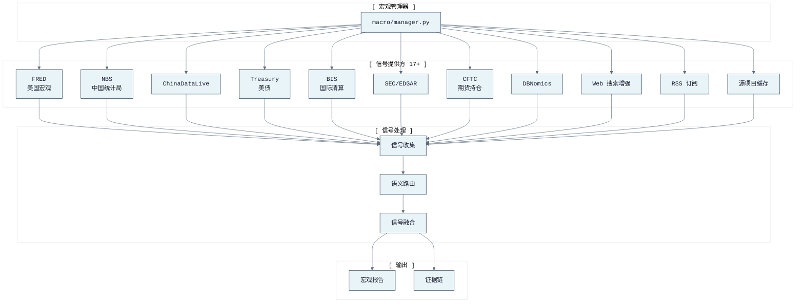
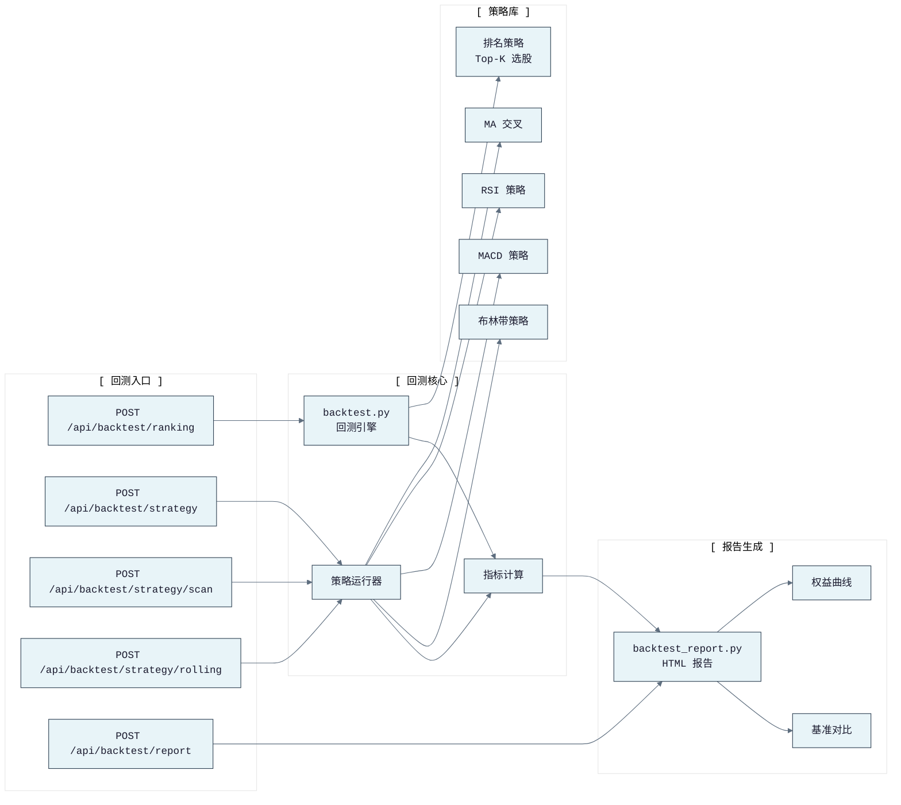
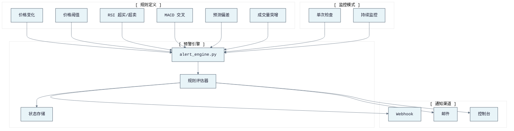
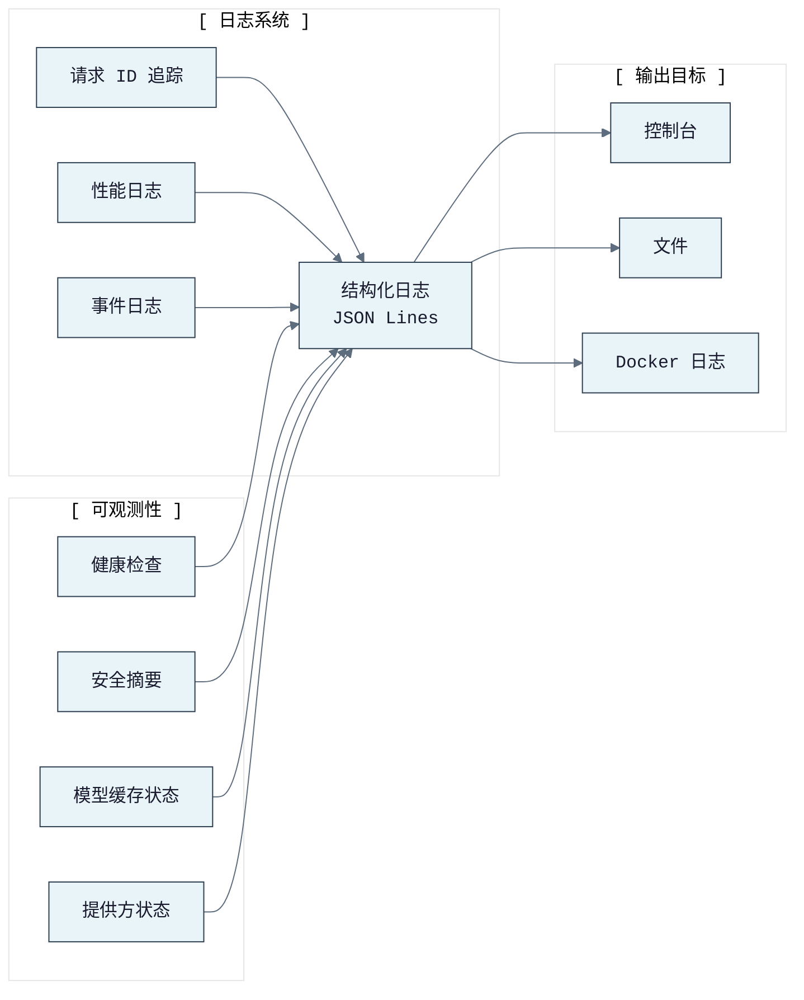

# KronosFinceptLab 架构文档

> 本文档基于当前代码库（v11 数据源与服务面对齐后）编写，聚焦已实现架构而非历史设计意图。

---

## 导航

- [← 返回 README](../README.md)
- [→ API 接口文档](API.md)
- [→ CLI 命令文档](CLI.md)
- [→ 部署指南](DEPLOYMENT.md)
- [→ 快速启动](START_GUIDE.md)
- [→ FinceptTerminal 集成](FINCEPT_INTEGRATION.md)

---

## 产品形态

KronosFinceptLab 是本地优先的量化金融驾驶舱，提供四种入口：

1. **Web UI** — `web/` 下的 Next.js 应用，包含仪表盘、预测、批量、数据、分析、宏观、回测、预警、新闻、自选、设置等页面
2. **REST API** — `src/kronos_fincept/api/app.py` 中的 FastAPI，Web UI 与外部客户端共用
3. **CLI** — `src/kronos_fincept/cli/commands/` 下的 Click 命令树
4. **MCP 服务** — `kronos_mcp/kronos_mcp_server.py`，向 MCP 客户端暴露预测/数据/分析操作

后端以 Python 为主，前端为 TypeScript/Next.js。Docker 构建组合运行时：Next.js 独立服务对外暴露 3000 端口，内部通过 `127.0.0.1:8000` 访问 FastAPI。

---

## 系统架构全景



---

## 后端分层

### FastAPI 应用

`src/kronos_fincept/api/app.py` 构建应用并注册所有路由模块，同时提供：

- API 文档门控：`KRONOS_ENABLE_API_DOCS`
- 请求 ID 与结构化日志
- 请求体大小检查
- API 安全中间件
- CORS 配置
- 启动时 Kronos 模型预热（启用时）
- 路由注册：健康、预测、批量、数据、回测、分析、预警、新闻、建议、任务、管理诊断

### 预测与分析服务

`src/kronos_fincept/service.py` 是预测与相关操作的主共享服务层。

核心职责：

- 从 OHLCV 行进行单资产预测
- 批量预测与收益排名
- 通过 `sample_count` 进行概率预测采样
- 允许时的干运行降级
- 真实 Kronos 模型加载/缓存
- 元数据报告：耗时、后端、缓存键、加载等待、推理等待、模型缓存状态

API、CLI、MCP 层调用此共享服务，而非重复实现预测逻辑。

### 路由模块

已实现的 REST 接口：

| 领域 | 路由 |
|------|------|
| 健康 | `GET /api/health`, `GET /api/health/deep` |
| 预测 | `POST /api/forecast` |
| 批量 | `POST /api/batch` |
| 数据 | `POST /api/data/batch`, `GET /api/data/global/{symbol}`, `GET /api/data/indicator/{symbol}`, `GET /api/data/a-stock/{symbol}`, `GET /api/data/search`, `GET /api/data/money-flow/{symbol}`, `GET /api/data/sector-flow`, `GET /api/data/hsgt-flow`, `GET /api/data/source-market/{artifact}` |
| 回测 | `POST /api/backtest/ranking`, `POST /api/backtest/report`, `POST /api/backtest/strategy`, `POST /api/backtest/strategy/scan`, `POST /api/backtest/strategy/rolling` |
| 分析 | `POST /api/v1/analyze/agent`, `/macro`, `/ai`, `/dcf`, `/risk`, `/portfolio`, `/derivative` |
| 预警 | `POST /api/alert/rules`, `GET /api/alert/rules`, `DELETE /api/alert/rules/{rule_id}`, `POST /api/alert/check`, `POST /api/alert/presets/prediction-deviation` |
| 新闻 | `POST /api/news/rss` |
| 建议 | `GET /api/v1/suggestions` |
| 任务 | `GET /api/jobs`, `POST /api/jobs/forecast`, `POST /api/jobs/analyze`, `POST /api/jobs/batch`, `POST /api/jobs/backtest`, `GET /api/jobs/{job_id}`, `POST /api/jobs/{job_id}/cancel` |
| 自选 | `GET/POST/PUT/DELETE /api/watchlist/lists`, `POST /api/watchlist/research` |
| 管理 | `GET /api/admin/security/summary`, 模型缓存清除/预热/状态路由 |

### 异步任务

`src/kronos_fincept/api/routes/jobs.py` 为耗时预测和分析操作提供进程内任务存储。

- 预测任务调用共享预测路径
- 分析任务调用共享自然语言智能体路径
- 批量和回测任务复用同步 API 路由的相同请求模型
- 任务状态包含：状态、步骤、结果、错误、时间戳、进度相关元数据
- 存储有界且限时，适合单进程本地或小型部署，非分布式队列

### 安全层

`src/kronos_fincept/api/security.py` 与 `src/kronos_fincept/security_utils.py` 实现部署加固：

- `/api/health` 公开；其他 `/api/*` 路径需认证（除非 `KRONOS_AUTH_DISABLED=1`）
- API 密钥通过 `X-Kronos-Api-Key` 或 `Authorization: Bearer <key>` 发送
- 用户密钥来自 `KRONOS_API_KEYS`
- 管理/内部密钥来自 `KRONOS_ADMIN_API_KEYS`、`KRONOS_INTERNAL_API_KEYS` 或 `KRONOS_INTERNAL_API_KEY`
- 预警和管理路由需要管理密钥
- 前端代理（`web/src/app/api/[...path]/route.ts`）在边缘执行相同检查，使用内部密钥向上游转发

---

## 数据流架构



---

## 模块依赖图



---

## 前端架构



---

## 数据源架构



---

## 宏观信号架构



---

## 回测引擎架构



---

## 预警引擎架构



---

## 日志与可观测性



---

## 文件清单

```
src/kronos_fincept/
├── api/
│   ├── app.py                 # FastAPI 应用构建与路由注册
│   ├── security.py            # API 密钥认证与角色检查
│   ├── deps.py                  # 依赖注入
│   ├── models.py                # Pydantic 请求/响应模型
│   └── routes/
│       ├── forecast.py          # 单资产预测
│       ├── batch.py             # 批量预测排名
│       ├── data.py              # 行情数据、指标、搜索
│       ├── backtest.py          # 回测引擎（排名/策略/扫描/滚动）
│       ├── analyze.py           # 分析路由（智能体/宏观/AI/DCF/风险/组合/衍生品）
│       ├── alert.py             # 预警规则管理
│       ├── news.py              # RSS/Atom 新闻
│       ├── suggestions.py       # 建议提示
│       ├── jobs.py              # 异步任务
│       ├── watchlist.py         # 自选管理
│       └── admin.py             # 管理诊断
├── cli/
│   ├── main.py                  # CLI 入口
│   ├── output.py                # 输出格式化
│   └── commands/
│       ├── forecast.py          # 预测命令
│       ├── batch.py             # 批量命令
│       ├── data.py              # 数据命令
│       ├── backtest.py          # 回测命令
│       ├── analyze.py           # 分析命令
│       ├── alert.py             # 预警命令
│       ├── news.py              # 新闻命令
│       ├── serve.py             # 服务命令
│       ├── health.py            # 健康命令
│       ├── suggestions.py       # 建议命令
│       ├── model.py             # 模型工具
│       ├── jobs.py              # 任务命令
│       └── watchlist.py         # 自选命令
├── data_sources/
│   ├── __init__.py              # 数据源管理器初始化
│   ├── eastmoney_source.py      # 东方财富（A股资金流/板块）
│   ├── akshare_source.py        # AkShare
│   ├── tushare_source.py        # Tushare Pro
│   ├── baostock_source.py       # BaoStock
│   ├── yahoo_source.py          # Yahoo Finance
│   ├── stooq_source.py          # Stooq
│   ├── binance_source.py        # Binance
│   ├── okx_source.py            # OKX
│   ├── tdx_source.py            # TDX 本地
│   ├── tdx_network_source.py    # TDX 网络
│   ├── tickflow_source.py       # TickFlow
│   └── source_market_cache.py   # 源项目缓存
├── financial/
│   ├── manager.py               # 财务数据管理器（熔断/缓存/降级）
│   ├── indicators.py            # 技术指标（SMA/EMA/RSI/MACD/BB/KDJ/CCI/ATR/OBV）
│   ├── strategies.py            # 策略定义
│   ├── dcf.py                   # DCF 估值
│   ├── risk.py                  # 风险指标
│   ├── portfolio.py             # 组合优化
│   ├── derivatives.py           # 衍生品定价
│   ├── schemas.py               # 财务数据结构
│   ├── financial_source.py      # 财务数据源基类/统一接口
│   ├── global_market.py         # 全球市场数据
│   ├── baostock_financial.py    # BaoStock 财务源
│   └── yahoo_financial.py       # Yahoo 财务源
├── macro/
│   ├── manager.py               # 宏观数据管理器
│   ├── schemas.py               # 宏观信号结构
│   └── providers/               # 宏观信号提供方
│       ├── base.py              # 提供方基类
│       ├── fred.py              # FRED 美国宏观
│       ├── nbs_live.py          # 中国统计局实时
│       ├── chinalive.py         # ChinaDataLive
│       ├── china_macro.py       # 中国宏观聚合
│       ├── dbnomics.py          # DBNomics
│       ├── digital_oracle.py    # Digital Oracle
│       ├── source_project_cache.py # 源项目宏观缓存
│       └── ...
├── agent.py                     # AI 智能体编排（路由/工具调用/报告生成）
├── service.py                   # 共享预测服务
├── predictor.py                 # Kronos 模型推理（加载/缓存/干运行）
├── alert_engine.py              # 预警引擎
├── backtest_report.py           # HTML 回测报告生成
├── config.py                    # 配置管理
├── logging_config.py            # 结构化日志配置
├── security_utils.py            # 安全工具（SSRF/URL 校验）
├── web_search.py                # 网络搜索客户端（Tavily/Brave/Serper/AnySearch）
├── schemas.py                   # 共享数据结构
├── build_info.py                # 构建信息
├── runtime_env.py               # 运行时环境
├── runtime_store.py             # 运行时状态存储
├── data_adapter.py              # 数据适配器
├── akshare_adapter.py           # AkShare 适配器
├── cninfo.py                    # 巨潮资讯
└── cli.py                       # CLI 兼容入口

web/src/
├── app/                         # Next.js App Router 页面
├── components/                  # React 组件
├── lib/                         # 工具库（API 客户端、Query Key、市场配置）
├── stores/                      # Zustand 状态管理
└── types/                       # TypeScript 类型

kronos_mcp/
├── kronos_mcp_server.py         # MCP 服务实现（59 个符号）
└── __init__.py
```

---

## 关键技术决策

### 1. 本地优先设计

所有核心能力在本地运行，无需外部依赖。外部服务（数据源、LLM）为可选增强，失败时自动降级。

### 2. 数据源熔断与降级

- 每个数据源独立熔断（5 次失败 / 5 分钟冷却）
- 自动降级到下一数据源
- 内存 + 文件缓存减少重复请求
- 过时缓存作为最后防线

### 3. 统一 LLM 路由

所有 AI 功能通过单一 OpenAI 兼容接口：`LLM_API_KEY` + `LLM_BASE_URL` + `LLM_MODEL`。支持：

- 结构化 JSON 输出
- 工具调用
- 上下文预算管理
- 降级链（主 -> 备选 -> 本地）

### 4. 前端代理架构

Next.js 前端通过 `api/[...path]` 路由代理到 FastAPI，在边缘执行：

- 认证检查
- 请求体大小限制
- 内部密钥转发
- 超时控制

### 5. 进程内任务队列

异步任务使用内存存储，适合单进程部署。非分布式，但支持：

- 任务提交/取消/查询
- 进度跟踪
- 有界存储（自动清理旧任务）

---

## 性能特征

| 指标 | 数值 | 说明 |
|------|------|------|
| 文件数 | 243 | 后端 185 Python + 前端 44 TS/TSX |
| 符号数 | 4,911 | 函数 1,618 + 方法 827 + 类 326 |
| 依赖边 | 11,460 | 调用关系 |
| 测试模块 | 70+ | 覆盖核心功能 |
| 数据源 | 13+ | A股/全球/宏观 |
| 宏观提供方 | 17+ | 多维度信号 |
| 技术指标 | 10+ | 常用技术分析 |
| 回测策略 | 5+ | 排名/MA/RSI/MACD/布林带 |

---

## 导航

- [← 返回 README](../README.md)
- [→ API 接口文档](API.md)
- [→ CLI 命令文档](CLI.md)
- [→ 部署指南](DEPLOYMENT.md)
- [→ 快速启动](START_GUIDE.md)
- [→ FinceptTerminal 集成](FINCEPT_INTEGRATION.md)
