# KronosFinceptLab CLI 命令文档

> 本文档描述所有 CLI 命令、参数和用法示例。

---

## 导航

- [← 返回 README](../README.md)
- [← 架构文档](ARCHITECTURE.md)
- [← API 接口文档](API.md)
- [→ 部署指南](DEPLOYMENT.md)
- [→ 快速启动](START_GUIDE.md)

---

## 安装

```bash
pip install -e ".[api,astock,cli,kronos]"
```

---

## 全局选项

```bash
kronos --output json <command>
kronos --output table <command>
```

- `--output json`：默认机器可读格式
- `--output table`：部分命令支持的人类可读表格

---

## 命令结构

```mermaid
%%{init: {'theme': 'base', 'themeVariables': { 'primaryColor': '#e8f4f8', 'primaryTextColor': '#1a1a2e', 'primaryBorderColor': '#2c3e50', 'lineColor': '#5d6d7e', 'secondaryColor': '#f0f3f4', 'tertiaryColor': '#ffffff', 'fontFamily': 'monospace'}}}%%
graph TB
    subgraph top_level["[ kronos 顶层命令 ]"]
        Forecast["forecast\n单资产预测"]
        Batch["batch\n批量预测排名"]
        Data["data\n行情数据"]
        Backtest["backtest\n策略回测"]
        Serve["serve\n启动服务"]
        Analyze["analyze\nAI 分析"]
        Alert["alert\n预警管理"]
        News["news\nRSS 新闻"]
        Health["health\n健康检查"]
        Suggestions["suggestions\n建议提示"]
        Model["model\n模型工具"]
        Jobs["jobs\n异步任务"]
        Watchlist["watchlist\n自选管理"]
    end

    subgraph data_sub["[ data 子命令 ]"]
        Fetch["fetch\n获取行情"]
        Indicator["indicator\n技术指标"]
        Search["search\n品种搜索"]
        MoneyFlow["money-flow\n资金流"]
        SectorFlow["sector-flow\n板块流"]
        HsgtFlow["hsgt-flow\n港股通"]
        SourceMarket["source-market\n源项目缓存"]
    end

    subgraph analyze_sub["[ analyze 子命令 ]"]
        Agent["agent\n智能体分析"]
        Macro["macro\n宏观分析"]
        AIAnalyze["ai-analyze\nAI 个股报告"]
        AIQuestion["ai-question\nAI 问答"]
        AIReport["ai-report\nAI 报告"]
        DCF["dcf\nDCF 估值"]
        Risk["risk\n风险指标"]
        Portfolio["portfolio\n组合优化"]
        Derivative["derivative\n衍生品定价"]
        GlobalData["global-data\n全球数据"]
        MarketSummary["market-summary\n市场摘要"]
        IndicatorCmd["indicator\n技术指标"]
        StrategyCmd["strategy\n策略信号"]
        Providers["providers\n提供方状态"]
    end

    subgraph backtest_sub["[ backtest 子命令 ]"]
        Ranking["ranking\n排名回测"]
        Report["report\n报告生成"]
        StrategyBacktest["strategy\n策略回测"]
        StrategyScan["strategy/scan\n参数扫描"]
        StrategyRolling["strategy/rolling\n滚动验证"]
    end

    Data --> Fetch
    Data --> Indicator
    Data --> Search
    Data --> MoneyFlow
    Data --> SectorFlow
    Data --> HsgtFlow
    Data --> SourceMarket

    Analyze --> Agent
    Analyze --> Macro
    Analyze --> AIAnalyze
    Analyze --> AIQuestion
    Analyze --> AIReport
    Analyze --> DCF
    Analyze --> Risk
    Analyze --> Portfolio
    Analyze --> Derivative
    Analyze --> GlobalData
    Analyze --> MarketSummary
    Analyze --> IndicatorCmd
    Analyze --> StrategyCmd
    Analyze --> Providers

    Backtest --> Ranking
    Backtest --> Report
    Backtest --> StrategyBacktest
    Backtest --> StrategyScan
    Backtest --> StrategyRolling
```



---

## 命令速查表

| 命令 | 用途 | 示例 |
|------|------|------|
| `forecast` | 单资产 Kronos 预测 | `kronos forecast --symbol 600036 --pred-len 5` |
| `batch` | 多资产预测排名 | `kronos batch --symbols 600036,000858 --pred-len 5` |
| `data fetch` | 获取行情数据 | `kronos data fetch --symbol 600036 --start 20240101` |
| `data indicator` | 技术指标 | `kronos data indicator --symbol 600036` |
| `data search` | 品种搜索 | `kronos data search --q "招商银行"` |
| `data money-flow` | 主力资金流 | `kronos data money-flow --symbol 600036 --limit 60` |
| `data sector-flow` | 板块资金流 | `kronos data sector-flow --sector-type industry` |
| `data hsgt-flow` | 港股通 | `kronos data hsgt-flow --start 20250101` |
| `data source-market` | 源项目缓存 | `kronos data source-market --artifact summary` |
| `backtest ranking` | 排名回测 | `kronos backtest ranking --symbols 600036,000858` |
| `backtest report` | 报告生成 | `kronos backtest report --symbols 600036,000858` |
| `backtest strategy` | 策略回测 | `kronos backtest strategy --symbol 600036` |
| `analyze agent` | 智能体分析 | `kronos analyze agent --question "招商银行现在能买吗？"` |
| `analyze macro` | 宏观分析 | `kronos analyze macro --question "美债收益率如何影响黄金？"` |
| `analyze ai-analyze` | AI 个股报告 | `kronos analyze ai-analyze --symbol 600036` |
| `analyze dcf` | DCF 估值 | `kronos analyze dcf --symbol AAPL` |
| `analyze risk` | 风险指标 | `kronos analyze risk --symbol AAPL` |
| `analyze portfolio` | 组合优化 | `kronos analyze portfolio --symbols AAPL,MSFT,NVDA` |
| `analyze derivative` | 期权定价 | `kronos analyze derivative --underlying 100 --strike 105` |
| `alert add` | 添加预警 | `kronos alert add --type price_change --symbol 600036` |
| `alert list` | 列出预警 | `kronos alert list` |
| `alert check` | 检查预警 | `kronos alert check` |
| `alert monitor` | 持续监控 | `kronos alert monitor --interval 5` |
| `news rss` | RSS 新闻 | `kronos news rss --feed "https://example.com/feed.xml"` |
| `health` | 健康检查 | `kronos health` |
| `suggestions` | 建议提示 | `kronos suggestions --type analysis` |
| `serve` | 启动服务 | `kronos serve --host 0.0.0.0 --port 8000` |
| `jobs list` | 列出任务 | `kronos jobs list` |
| `jobs show` | 查看任务 | `kronos jobs show {job_id}` |
| `jobs cancel` | 取消任务 | `kronos jobs cancel {job_id}` |
| `watchlist list` | 列出自选 | `kronos watchlist list` |
| `watchlist create` | 创建自选 | `kronos watchlist create --name "我的自选"` |
| `watchlist research` | 自选研究 | `kronos watchlist research --id {id}` |

---

## 详细命令

### 预测

```bash
# 单资产预测（干运行）
kronos forecast --symbol 600036 --pred-len 5 --dry-run

# 概率预测（蒙特卡洛采样）
kronos forecast --symbol 600036 --pred-len 5 --sample-count 10

# 表格输出
kronos --output table forecast --symbol 600036 --pred-len 5

# 从文件读取请求
kronos forecast --input request.json
```

### 批量

```bash
# 批量预测
kronos batch --symbols 600036,000858 --pred-len 5 --dry-run

# 表格输出
kronos --output table batch --symbols 600036,000858
```

### 数据

```bash
# 获取 A股行情
kronos data fetch --symbol 600036 --start 20240101 --end 20260430

# 获取美股行情
kronos data fetch --symbol AAPL --market us --start 20240101 --end 20260430

# 技术指标
kronos data indicator --symbol 600036

# 品种搜索
kronos data search --q "招商银行"

# 主力资金流
kronos data money-flow --symbol 600036 --limit 60

# 板块资金流
kronos data sector-flow --sector-type industry

# 港股通
kronos data hsgt-flow --start 20250101 --end 20260430

# 源项目缓存
kronos data source-market --artifact summary
kronos data source-market --artifact dragon_tiger --date 2026-05-26 --limit 100
```

`money-flow` 和 `sector-flow` 使用东方财富，无需 API 密钥。`hsgt-flow` 需要 `TUSHARE_TOKEN`。`source-market` 读取配置的源项目市场回顾缓存，缓存不可用时返回正常 JSON 错误，不阻塞启动。

### 回测

```bash
# 排名回测
kronos backtest ranking --symbols 600036,000858 --start 20250101 --end 20260430 --top-k 1

# 报告生成
kronos backtest report --symbols 600036,000858 --start 20250101 --end 20260430

# 表格输出（干运行）
kronos --output table backtest ranking --symbols 600036,000858 --dry-run

# 策略回测
kronos backtest strategy --symbol 600036 --strategy ma_crossover

# 参数扫描
kronos backtest strategy/scan --symbol 600036 --strategy ma_crossover

# 滚动验证
kronos backtest strategy/rolling --symbol 600036 --strategy ma_crossover --folds 5
```

### 分析

```bash
# 自然语言智能体
kronos analyze agent --question "招商银行现在能买吗？" --symbol 600036 --market cn

# 宏观分析
kronos analyze macro --question "美债收益率和美元如何影响黄金？" --symbols GC=F,DXY

# AI 个股分析
kronos analyze ai-analyze --symbol 600036 --market cn
kronos analyze ai-question --question "招商银行的主要风险是什么？" --symbol 600036
kronos analyze ai-report --symbol 600036

# 市场数据辅助
kronos analyze global-data --symbol AAPL --market us
kronos analyze market-summary

# 财务分析
kronos analyze dcf --symbol AAPL --shares 1000000000
kronos analyze risk --symbol AAPL --market-symbol SPY
kronos analyze portfolio --symbols AAPL,MSFT,NVDA
kronos analyze derivative --underlying 100 --strike 105 --expiry 0.5 --volatility 0.2 --rate 0.03

# 技术指标与策略
kronos analyze indicator --symbol 600036 --indicator rsi
kronos analyze strategy --symbol 600036 --strategy ma_crossover

# 宏观提供方状态
kronos analyze providers --output table
```

共享 LLM 路径使用单一 OpenAI 兼容提供方，通过 `LLM_API_KEY`、`LLM_BASE_URL`、`LLM_MODEL` 配置。网络搜索增强可选，由 `WEB_SEARCH_PROVIDER`、`WEB_SEARCH_API_KEY`、`ANYSEARCH_ENABLED` 控制。

### 预警

```bash
# 添加预警
kronos alert add --type price_change --symbol 600036 --threshold 3.0

# 列出预警
kronos alert list

# 删除预警
kronos alert remove {id}

# 检查预警
kronos alert check

# 持续监控
kronos alert monitor --interval 5
```

支持预警类型：`price_change`、`price_above`、`price_below`、`rsi_overbought`、`rsi_oversold`、`macd_crossover`、`prediction_deviation`、`volume_spike`。

### 建议

```bash
# 分析建议
kronos suggestions --type analysis

# 宏观建议
kronos suggestions --type macro
```

建议使用缓存/单飞行为，LLM 不可用时返回确定性降级。

### 新闻

```bash
# RSS 获取
kronos news rss --feed "fed|Federal Reserve|https://www.federalreserve.gov/feeds/press_all.xml" --limit 5

# JSON 输出
kronos news rss --feed https://example.com/feed.xml --json
```

RSS URL 必须为 HTTPS，通过 REST API 相同的公网安全验证。

### 服务

```bash
# 启动 API 服务
kronos serve --host 0.0.0.0 --port 8000

# 多 worker
kronos serve --host 0.0.0.0 --port 8000 --workers 4
```

交互式 API 文档需要 `KRONOS_ENABLE_API_DOCS=1`。

### 健康

```bash
kronos health
```

### 模型工具

```bash
# 干运行：打印上游 Kronos finetune_csv 命令
kronos model finetune-csv --config configs/finetune.yaml --stage sequential

# 执行上游脚本
kronos model finetune-csv --config configs/finetune.yaml --stage sequential --execute
```

### 异步任务

```bash
# 列出任务
kronos jobs list

# 查看任务
kronos jobs show {job_id}

# 取消任务
kronos jobs cancel {job_id}
```

### 自选

```bash
# 列出自选
kronos watchlist list

# 创建自选
kronos watchlist create --name "我的自选" --symbols 600036,000858

# 更新自选
kronos watchlist update {id} --name "更新后的自选"

# 删除自选
kronos watchlist delete {id}

# 自选研究
kronos watchlist research --id {id}
```

---

## 环境变量

| 变量 | 说明 | CLI 影响 |
|------|------|----------|
| `KRONOS_MODEL_ID` | 模型 ID | 预测命令 |
| `KRONOS_DEVICE` | cpu/cuda/rocm | 预测命令 |
| `KRONOS_ENABLE_REAL_MODEL` | 启用真实推理 | 预测命令 |
| `KRONOS_ALLOW_DRY_RUN` | 允许干运行 | 预测命令 |
| `LLM_API_KEY` | LLM 密钥 | 分析命令 |
| `LLM_BASE_URL` | LLM 端点 | 分析命令 |
| `LLM_MODEL` | LLM 模型 | 分析命令 |
| `TUSHARE_TOKEN` | Tushare 密钥 | 数据命令 |
| `KRONOS_API_KEYS` | 用户 API 密钥 | 所有命令 |
| `KRONOS_AUTH_DISABLED` | 禁用认证 | 所有命令 |

---

## 导航

- [← 返回 README](../README.md)
- [← 架构文档](ARCHITECTURE.md)
- [← API 接口文档](API.md)
- [→ 部署指南](DEPLOYMENT.md)
- [→ 快速启动](START_GUIDE.md)
