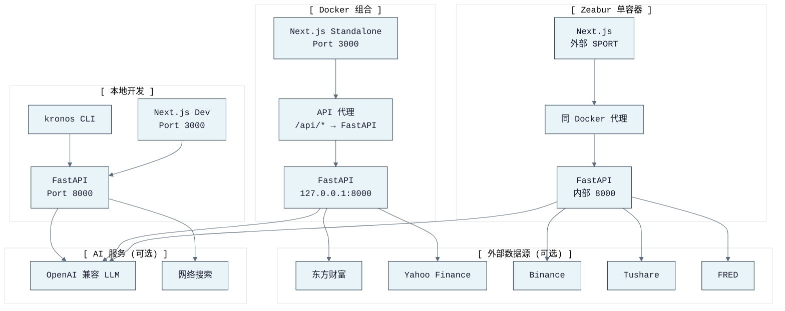
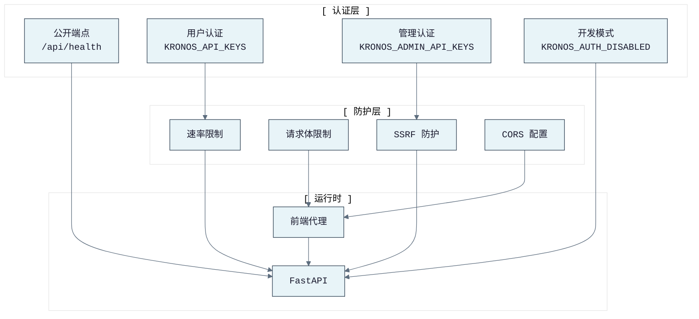

# KronosFinceptLab 部署指南

> 本文档描述本地开发、Docker、Zeabur 等部署方式。

---

## 导航

- [← 返回 README](../README.md)
- [← 架构文档](ARCHITECTURE.md)
- [← API 接口文档](API.md)
- [← CLI 命令文档](CLI.md)
- [→ 快速启动](START_GUIDE.md)

---

## 部署架构



---

## 本地开发

### 后端

```bash
cd KronosFinceptLab
python -m venv .venv
source .venv/bin/activate  # Windows: .venv\Scripts\activate
pip install -e ".[api,astock,cli,kronos,dev]"
kronos serve --host 0.0.0.0 --port 8000
```

替代 FastAPI 开发服务器：

```bash
PYTHONPATH=src uvicorn kronos_fincept.api.app:app --reload --port 8000
```

交互式 API 文档默认关闭。需要时显式启用：

```bash
KRONOS_ENABLE_API_DOCS=1 kronos serve --host 0.0.0.0 --port 8000
```

### 前端

```bash
cd web
npm install
npm run dev
```

开发前端运行于 http://localhost:3000，调用 http://localhost:8000 的 API。

### CLI

```bash
kronos forecast --symbol 600036 --pred-len 5 --dry-run
kronos analyze agent --question "招商银行现在能买吗？" --symbol 600036 --market cn
```

---

## Windows / WSL 启动脚本

```bash
# Windows：双击 start.bat 或终端运行
start.bat

# WSL/Linux
./start.sh
```

脚本同时启动 API 后端和 Web 前端供本地使用。

---

## Docker

```bash
docker-compose up --build
```

当前 Docker 镜像是组合 Web/API 运行时：

- Next.js 独立服务对外暴露 3000 端口
- FastAPI 内部监听 `127.0.0.1:8000`
- 前端通过 `INTERNAL_API_URL=http://127.0.0.1:8000` 访问后端
- 容器健康检查探测 `http://127.0.0.1:8000/api/health`

---

## Zeabur / 单容器运行时

`scripts/zeabur_start.sh` 在单容器中启动两个服务：

```text
python -m uvicorn kronos_fincept.api.app:app --host $API_HOST --port $API_PORT
node /app/web/server.js on $PORT
```

默认容器环境：

| 变量 | 默认值/角色 |
|------|------------|
| `PORT` | 公共 Web 端口，默认 3000 |
| `API_HOST` | 内部 API 绑定主机，默认 127.0.0.1 |
| `API_PORT` | 内部 API 端口，默认 8000 |
| `INTERNAL_API_URL` | 前端到后端 URL，默认 http://127.0.0.1:8000 |
| `KRONOS_MODEL_ID` | 默认 NeoQuasar/Kronos-base |
| `KRONOS_ENABLE_REAL_MODEL` | Docker 默认启用真实模型推理 |
| `KRONOS_ALLOW_DRY_RUN` | Docker 默认禁用干运行降级 |
| `KRONOS_PREWARM_ON_STARTUP` | Docker 默认预加载模型 |
| `KRONOS_LOW_MEMORY_DEFAULTS` | 启用保守线程和导入默认值 |
| `KRONOS_LOG_FORMAT` | Docker 默认 json |
| `KRONOS_LOG_ENABLE_FILE` | Docker 默认禁用文件日志 |

---

## 环境变量

| 变量 | 说明 |
|------|------|
| `KRONOS_MODEL_ID` | 模型 ID，默认 NeoQuasar/Kronos-base |
| `KRONOS_DEVICE` | cpu、cuda 或 rocm |
| `KRONOS_REPO_PATH` | 上游 Kronos 仓库路径 |
| `HF_HOME` / `HF_HUB_CACHE` | HuggingFace 缓存/模型权重目录 |
| `KRONOS_ENABLE_REAL_MODEL` | 启用真实 Kronos 推理后端 |
| `KRONOS_ALLOW_DRY_RUN` | 允许干运行降级请求 |
| `KRONOS_PREWARM_ON_STARTUP` | API 启动时预加载模型 |
| `KRONOS_LOW_MEMORY_DEFAULTS` | 应用低内存默认值（BLAS/tokenizer 线程和启动行为） |
| `KRONOS_API_KEYS` | 用户 API 密钥 |
| `KRONOS_ADMIN_API_KEYS` | 预警/管理路由的管理密钥 |
| `KRONOS_INTERNAL_API_KEY` / `KRONOS_INTERNAL_API_KEYS` | 内部管理密钥 |
| `KRONOS_AUTH_DISABLED` | 仅本地开发禁用 API 认证 |
| `KRONOS_ENABLE_API_DOCS` | 启用 /docs、/redoc 和 /openapi.json |
| `LLM_API_KEY` | 统一 OpenAI 兼容 LLM 密钥 |
| `LLM_BASE_URL` | OpenAI 兼容对话补全端点或基础 URL |
| `LLM_MODEL` | 路由、宏观分析、报告合成的 LLM 模型 ID |
| `TUSHARE_TOKEN` | 可选 Tushare Pro 密钥（港股通和 A股增强） |
| `FRED_API_KEY` | 可选 FRED 密钥（美国宏观数据） |
| `KRONOS_SOURCE_PROJECT_ROOT` | 可选源项目根目录（验证市场和宏观缓存复用） |
| `KRONOS_ENABLE_TDX_NETWORK` | 可选 TDX 网络源；默认禁用（Linux/Zeabur 安全） |
| `KRONOS_ENABLE_TICKFLOW` | 可选 TickFlow 源；依赖不可用时跳过 |
| `KRONOS_ENABLE_NBS_LIVE` | 可选 NBS 实时客户端；默认禁用 |
| `WEB_SEARCH_PROVIDER` / `WEB_SEARCH_API_KEY` | 通用网络搜索增强 |
| `ANYSEARCH_ENABLED` | 可选 AnySearch 增强开关 |

---

## 端口

| 服务 | 本地开发 | Docker/Zeabur |
|------|---------|---------------|
| Web 前端 | http://localhost:3000 | 公共端口 3000 / $PORT |
| 后端 API | http://localhost:8000 | 内部 127.0.0.1:8000 |
| API 文档 | http://localhost:8000/docs（需 KRONOS_ENABLE_API_DOCS=1） | 默认内部，除非显式暴露 |

---

## 部署注意事项

- 公共部署不要启用 `KRONOS_AUTH_DISABLED=1`
- 至少配置一个用户 API 密钥用于正常 Web/API 使用，一个管理密钥用于预警/管理诊断
- API 文档在公共部署中应保持关闭，除非明确需要
- 真实模型推理需要上游 Kronos 仓库和 HuggingFace 模型缓存对运行时可用
- 外部数据源按需配置；未配置时返回正常错误，不阻塞启动

---

## 安全模型



---

## 导航

- [← 返回 README](../README.md)
- [← 架构文档](ARCHITECTURE.md)
- [← API 接口文档](API.md)
- [← CLI 命令文档](CLI.md)
- [→ 快速启动](START_GUIDE.md)
