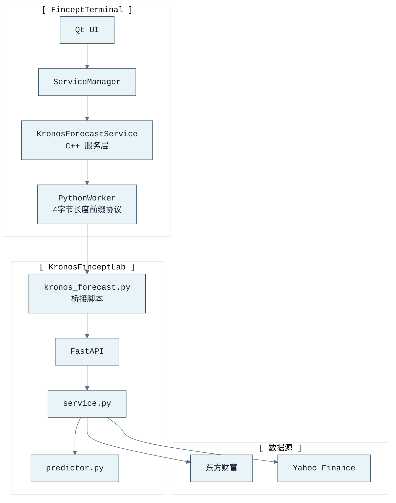

# FinceptTerminal 集成指南

> 本文档描述 KronosFinceptLab 与 FinceptTerminal 的集成方式。

---

## 导航

- [← 返回 README](../README.md)
- [← 架构文档](ARCHITECTURE.md)
- [← 快速启动](START_GUIDE.md)

---

## 集成架构



---

## 端到端集成状态

当前 KronosFinceptLab 服务通过 REST、CLI、Web 和 MCP 暴露预测、批量、行情数据、资金流、源市场缓存、回测、AI 智能体、宏观、预警、自选和健康操作。FinceptTerminal 可继续使用 Python 桥接进行预测/批量，也可使用 MCP 获取更丰富的分析/数据工具。

### 已验证

| 组件 | 状态 | 说明 |
|------|------|------|
| 桥接脚本 | 已部署 | kronos_forecast.py 位于 fincept-qt/scripts/ |
| PythonWorker 协议 | 兼容 | 4字节长度前缀帧已测试 |
| 预测（干运行） | 通过 | 单资产预测正确返回 |
| 批量预测 | 通过 | 多资产排名正确返回 |
| 关闭 | 通过 | 干净退出 |
| 错误处理 | 通过 | 错误返回不崩溃 |
| C++ 服务层 | 已编写 | KronosForecastService.h/.cpp |

### 待完成（需 FinceptTerminal 编译）

- [ ] 将 C++ 文件添加到 FinceptTerminal CMakeLists.txt
- [ ] 在 ServiceManager 中注册 KronosForecastService
- [ ] 向 UI 添加 Kronos 预测面板
- [ ] 在 Python 虚拟环境中安装 kronos_fincept 包

---

## 快速集成步骤

### 1. 复制文件到 FinceptTerminal

```bash
# 桥接脚本（已完成）
cp integrations/fincept_terminal/scripts/kronos_forecast.py \
   /path/to/FinceptTerminal/fincept-qt/scripts/

# C++ 服务层
cp integrations/fincept_terminal/src/KronosForecastService.h \
   /path/to/FinceptTerminal/fincept-qt/src/services/kronos/

cp integrations/fincept_terminal/src/KronosForecastService.cpp \
   /path/to/FinceptTerminal/fincept-qt/src/services/kronos/
```

### 2. 修改 CMakeLists.txt

添加到 `fincept-qt/CMakeLists.txt` 的 `SOURCES` 列表：

```cmake
src/services/kronos/KronosForecastService.cpp
```

添加到 `HEADERS` 列表：

```cmake
src/services/kronos/KronosForecastService.h
```

### 3. 注册服务

在 `ServiceManager.cpp` 或相关初始化文件中：

```cpp
#include "services/kronos/KronosForecastService.h"

// 在初始化函数中：
auto& kronos = fincept::kronos::KronosForecastService::instance();
Q_UNUSED(kronos); // 触发单例初始化
```

### 4. 安装 Python 依赖

在 FinceptTerminal 的 Python 虚拟环境中：

```bash
# 激活虚拟环境
source /path/to/FinceptTerminal/fincept-qt/venv-numpy2/bin/activate

# 安装 kronos_fincept
cd /path/to/KronosFinceptLab
pip install -e ".[kronos,astock]"
```

### 5. 下载模型

```bash
# 通过 HuggingFace 镜像（国内更快）
python -c "
from huggingface_hub import snapshot_download
import os
os.environ['HF_ENDPOINT'] = 'https://hf-mirror.com'
snapshot_download('NeoQuasar/Kronos-base', local_dir='external/Kronos-base')
snapshot_download('NeoQuasar/Kronos-Tokenizer-base', local_dir='external/Kronos-Tokenizer-base')
"
```

---

## C++ 使用示例

### 单资产预测

```cpp
#include "services/kronos/KronosForecastService.h"

auto& kronos = fincept::kronos::KronosForecastService::instance();

// 构建 OHLCV 数据
QJsonArray rows;
QJsonObject row1;
row1["timestamp"] = "2026-04-01";
row1["open"] = 1400;
row1["high"] = 1420;
row1["low"] = 1390;
row1["close"] = 1410;
rows.append(row1);
// ... 添加更多行

kronos.forecast("600036", "1d", 5, rows,
    [](fincept::kronos::ForecastResult result) {
        if (result.ok) {
            qDebug() << "预测:" << result.data;
        } else {
            qDebug() << "错误:" << result.error;
        }
    });
```

### 批量排名

```cpp
QJsonArray assets;
QJsonObject asset1;
asset1["symbol"] = "600036";
asset1["rows"] = rows1;
assets.append(asset1);
// ... 更多资产

kronos.batch_forecast(assets, 5,
    [](bool ok, QVector<fincept::kronos::RankedSignal> signals, QString error) {
        if (ok) {
            for (const auto& sig : signals) {
                qDebug() << sig.rank << sig.symbol << sig.signal
                         << sig.predicted_return_pct << "%";
            }
        }
    });
```

### 获取 A股数据

```cpp
kronos.fetch_a_stock("600036", "20250101", "20260429",
    [](fincept::kronos::ForecastResult result) {
        if (result.ok) {
            int count = result.data.value("count").toInt();
            qDebug() << "获取" << count << "行 A股数据";
        }
    });
```

---

## 文件清单

```
KronosFinceptLab/
├── integrations/fincept_terminal/
│   ├── scripts/
│   │   └── kronos_forecast.py          # 桥接脚本（已部署到 FinceptTerminal）
│   ├── src/
│   │   ├── KronosForecastService.h     # C++ 服务层头文件
│   │   └── KronosForecastService.cpp   # C++ 服务层实现
│   └── qlib_adapter/
│       └── kronos_model_adapter.py     # Qlib/AI Quant Lab 适配器
├── tests/
│   └── test_fincept_integration.py     # 端到端集成测试（PythonWorker 协议）
└── docs/
    └── FINCEPT_INTEGRATION.md          # 本文档
```

---

## 导航

- [← 返回 README](../README.md)
- [← 架构文档](ARCHITECTURE.md)
- [← 快速启动](START_GUIDE.md)
