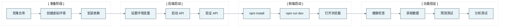

# KronosFinceptLab 快速启动指南

> 本文档提供首次运行 KronosFinceptLab 的逐步指引。
>
> 文档状态：Current | 项目版本：10.9.0 | 最后核对：2026-07-31

---

## 导航

- [← 返回 README](../README.md)
- [← 架构文档](ARCHITECTURE.md)
- [← API 接口文档](API.md)
- [← CLI 命令文档](CLI.md)
- [← 部署指南](DEPLOYMENT.md)
- [→ FinceptTerminal 集成](FINCEPT_INTEGRATION.md)

---

## 启动流程


```mermaid
%%{init: {'theme': 'base', 'themeVariables': { 'primaryColor': '#e8f4f8', 'primaryTextColor': '#1a1a2e', 'primaryBorderColor': '#2c3e50', 'lineColor': '#5d6d7e', 'secondaryColor': '#f0f3f4', 'tertiaryColor': '#ffffff', 'fontFamily': 'monospace'}}}%%
graph LR
    subgraph prepare["[ 准备阶段 ]"]
        Clone["克隆仓库"]
        Venv["创建虚拟环境"]
        Install["安装依赖"]
    end

    subgraph backend["[ 后端启动 ]"]
        BackendEnv["设置环境变量"]
        StartAPI["启动 API"]
        VerifyAPI["验证 API"]
    end

    subgraph frontend["[ 前端启动 ]"]
        FrontendInstall["npm install"]
        StartWeb["npm run dev"]
        OpenBrowser["打开浏览器"]
    end

    subgraph verify["[ 功能验证 ]"]
        HealthCheck["健康检查"]
        DataFetch["获取数据"]
        Forecast["预测测试"]
        Analyze["分析测试"]
    end

    Clone --> Venv --> Install --> BackendEnv --> StartAPI --> VerifyAPI
    VerifyAPI --> FrontendInstall --> StartWeb --> OpenBrowser
    OpenBrowser --> HealthCheck --> DataFetch --> Forecast --> Analyze
```

---

## Windows（双击启动）

双击 `start.bat` 同时启动两个服务：

1. **API 后端** — 在独立窗口运行于 http://localhost:8000
2. **Web 前端** — 在独立窗口运行于 http://localhost:3000

浏览器将自动打开。

---

## WSL/Linux

```bash
./start.sh
```

按 `Ctrl+C` 停止所有服务。

---

## 手动启动

### Windows PowerShell（本机已验证）

本地开发必须分别启动 API 和 Next.js 开发服务器，并从项目根目录/`web` 目录启动对应进程。不要使用 `next start`，也不要让 Web 服务因为端口占用自动漂移到 3001。

终端 1：启动 API（保持窗口运行）

```powershell
Set-Location 'E:\AI_Projects\KronosFinceptLab'
$env:PYTHONPATH = 'src'
& 'E:\AI_Projects\KronosFinceptLab\.venv311\Scripts\python.exe' -m uvicorn kronos_fincept.api.app:app --host 127.0.0.1 --port 8000 --workers 1
```

终端 2：启动 Web（保持窗口运行）

```powershell
Set-Location 'E:\AI_Projects\KronosFinceptLab\web'
& 'D:\nodejs\npm.cmd' run dev
```

启动后检查：

```powershell
Invoke-WebRequest 'http://127.0.0.1:8000/api/health' -UseBasicParsing
Invoke-WebRequest 'http://127.0.0.1:3000/macro' -UseBasicParsing
```

如果页面能返回 HTML 但 CSS/JS 资源出现 404，说明旧的 Next 进程或 `.next` 开发缓存不同步。停止占用 3000 端口的旧 Node/Next 进程后，在 `web` 目录重新执行 `npm run dev`；必要时仅清理项目内生成缓存 `web\.next`，不要改用 `next start`。

### 启动 API 后端

```bash
# Windows
set PYTHONPATH=src
python -m kronos_fincept.api.app

# WSL/Linux
PYTHONPATH=src python3 -m kronos_fincept.api.app
```

或通过 CLI 启动：

```bash
kronos serve --host 0.0.0.0 --port 8000
```

交互式 API 文档默认关闭。仅在需要时启用：

```bash
set KRONOS_ENABLE_API_DOCS=1        # Windows cmd
# export KRONOS_ENABLE_API_DOCS=1   # WSL/Linux
kronos serve --host 0.0.0.0 --port 8000
```

### 启动 Web 前端

```bash
cd web
npm install  # 首次
npm run dev
```

---

## 访问地址

| 服务 | 地址 | 说明 |
|------|------|------|
| Web 前端 | http://localhost:3000 | 仪表盘、预测、批量、数据、分析、宏观、回测、预警、新闻、自选、设置 |
| API 后端 | http://localhost:8000 | REST API，Web/CLI/外部客户端使用 |
| API 文档 | http://localhost:8000/docs | 需 KRONOS_ENABLE_API_DOCS=1 |
| 健康 | http://localhost:8000/api/health | 公开健康端点 |

---

## 快速功能验证

```bash
# 健康检查
kronos health

# 获取数据
kronos data fetch --symbol 600036 --start 20250101 --end 20260430

# 资金流
kronos data money-flow --symbol 600036 --limit 10

# 板块流
kronos data sector-flow --sector-type industry

# 源项目缓存
kronos data source-market --artifact summary

# 宏观分析
kronos analyze macro --question "美债收益率如何影响黄金？" --symbols GC=F,DXY

# RSS 新闻
kronos news rss --feed "fed|Federal Reserve|https://www.federalreserve.gov/feeds/press_all.xml" --limit 5
```

`source-market` 依赖 `KRONOS_SOURCE_PROJECT_ROOT`。`hsgt-flow` 依赖 `TUSHARE_TOKEN`。未配置时命令/API 返回正常错误，不阻塞启动。

---

## API 密钥

大多数 `/api/*` 端点需要 API 密钥（除非本地认证通过 `KRONOS_AUTH_DISABLED=1` 禁用）。

- 用户密钥：`KRONOS_API_KEYS`
- 管理密钥：`KRONOS_ADMIN_API_KEYS`、`KRONOS_INTERNAL_API_KEY` 或 `KRONOS_INTERNAL_API_KEYS`
- Web UI 存储密钥：浏览器 `localStorage` 中的 `kronos_api_key`
- 请求头：`X-Kronos-Api-Key`

本地实验可用 `KRONOS_AUTH_DISABLED=1`，公共部署不可使用。

---

## 低内存启动

本地配置默认不预热模型；当前 Docker 镜像默认启用预热。对于小内存容器，建议显式设置：

```bash
KRONOS_MODEL_ID=NeoQuasar/Kronos-mini
KRONOS_PREWARM_ON_STARTUP=0
```

除非设置 `KRONOS_API_RELOAD=1`，API 重载保持关闭。TDX 网络、TickFlow、NBS 实时等可选源仅在显式启用并且依赖可用时加载。

---

## 停止服务

### Windows

- 关闭 "KronosFinceptLab API" 和 "KronosFinceptLab Web" 命令窗口。

### WSL/Linux

- 在运行 `start.sh` 的终端按 `Ctrl+C`。

---

## 故障排查

### 端口占用

端口 8000 或 3000 被占用时：

- 关闭占用端口的程序
- 或修改启动脚本中的端口号

### Python 未找到

确保 Python 3.11+ 已安装并添加到 PATH。

### Node.js 未找到

确保 Node.js 18+ 已安装并添加到 PATH。

### API 文档返回 404

除非启动后端前设置 `KRONOS_ENABLE_API_DOCS=1`，否则预期行为。

### API 请求返回 401 或 403

在 Web 设置页、浏览器 `localStorage` 或请求头中设置有效 API 密钥。预警和管理路由需要管理/内部密钥。

### npm install 失败

尝试清除缓存并重装：

```bash
cd web
rm -rf node_modules package-lock.json
npm install
```

---

## 导航

- [← 返回 README](../README.md)
- [← 架构文档](ARCHITECTURE.md)
- [← API 接口文档](API.md)
- [← CLI 命令文档](CLI.md)
- [← 部署指南](DEPLOYMENT.md)
- [→ FinceptTerminal 集成](FINCEPT_INTEGRATION.md)
