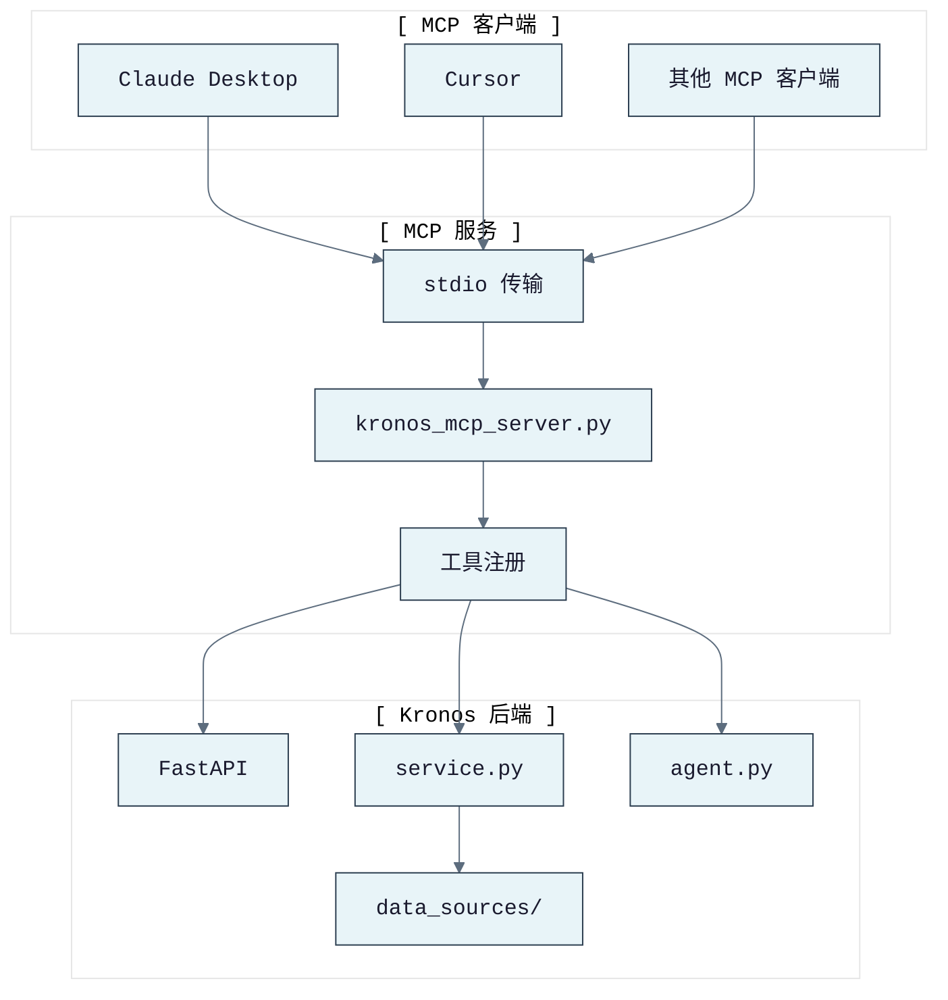

# KronosFinceptLab MCP 服务

> Kronos MCP（Model Context Protocol）服务，提供金融 K线预测、行情数据、资金流、源项目缓存、回测、AI 分析、宏观分析、任务、预警、自选研究、建议和 health 检查等工具。

---

## 导航

- [← 返回项目 README](../README.md)
- [← 架构文档](../docs/ARCHITECTURE.md)
- [← API 接口文档](../docs/API.md)

---

## 工具清单

| 工具 | 说明 |
|------|------|
| `forecast_ohlcv` | 单资产 OHLCV K线预测 |
| `batch_forecast_ohlcv` | 多资产批量预测与收益排名 |
| `fetch_a_stock` | 获取 A股日 K线数据 |
| `search_stocks` | 搜索 A股股票/品种 |
| `calculate_indicators` | 计算技术指标（RSI/MACD/SMA/EMA 等） |
| `get_money_flow` | 获取东方财富主力资金流 |
| `get_sector_flow` | 获取东方财富板块/概念/地区资金流排名 |
| `get_hsgt_flow` | 获取港股通资金流（需配置 Tushare） |
| `get_source_market_artifact` | 读取源项目市场回顾缓存摘要或产物 |
| `run_ranking_backtest` | 运行多代码排名回测 |
| `generate_backtest_report` | 生成回测报告 |
| `run_strategy_backtest` | 运行策略回测 |
| `run_strategy_scan` | 运行策略参数扫描 |
| `analyze_agent` | 自然语言无状态投资分析智能体 |
| `analyze_macro` | 宏观与跨市场信号分析 |
| `analyze_ai` | AI 个股分析报告 |
| `analyze_dcf` | DCF 估值分析 |
| `analyze_risk` | 风险指标分析 |
| `analyze_portfolio` | 组合优化分析 |
| `analyze_derivative` | 衍生品定价分析 |
| `generate_suggestions` | 生成分析或宏观提示建议 |
| `fetch_rss_news` | 获取 HTTPS RSS/Atom 新闻 |
| `submit_backtest_job` | 提交异步回测任务 |
| `get_job_status` | 读取进程内异步任务结果 |
| `list_jobs` | 列出任务历史 |
| `cancel_job` | 取消任务 |
| `create_prediction_deviation_alerts` | 创建预测偏差预警规则 |
| `list_alert_rules` | 列出预警规则 |
| `delete_alert_rule` | 删除预警规则 |
| `check_alert_rules` | 检查预警规则 |
| `macro_provider_status` | 返回宏观提供方状态 |
| `watchlist_research` | 构建加权自选研究摘要 |
| `watchlist_list` | 列出自选 |
| `watchlist_create` | 创建自选 |
| `watchlist_delete` | 删除自选 |
| `health_check` | 返回 API/模型/运行时健康信息 |

---

## MCP 架构



---

## 安装

```bash
pip install -e ".[mcp,kronos,astock]"
```

---

## 运行

```bash
# 直接执行（stdio 传输）
python kronos_mcp/kronos_mcp_server.py

# 或作为模块
python -m kronos_mcp.kronos_mcp_server
```

---

## MCP 客户端配置

### Claude Desktop / Cursor / 其他 MCP 客户端

添加到 MCP 客户端配置：

```json
{
  "mcpServers": {
    "kronos-fincept": {
      "command": "python",
      "args": ["kronos_mcp/kronos_mcp_server.py"],
      "cwd": "/path/to/KronosFinceptLab",
      "env": {
        "PYTHONPATH": "src",
        "KRONOS_REPO_PATH": "/path/to/Kronos",
        "HF_HOME": "/path/to/model/cache"
      }
    }
  }
}
```

真实模型部署需确保上游 Kronos 仓库和模型缓存可用。本地干运行或降级操作配置与 REST API/CLI 相同的环境变量。

服务应用低内存默认值，延迟重导入直到工具被调用。Tushare、TDX 网络、TickFlow、源项目缓存、NBS 实时等可选提供方在未配置时跳过或报告为每工具错误；它们不是启动阻塞项。

---

## FinceptTerminal 智能体集成

FinceptTerminal 的智能体/节点编辑器可通过 MCP 调用 Kronos 预测和分析能力：

1. 智能体接收用户请求，如"分析招商银行未来 5 天走势"。
2. 智能体调用 `fetch_a_stock` 获取 600036 历史数据。
3. 智能体调用 `forecast_ohlcv` 或 `batch_forecast_ohlcv` 进行预测。
4. 智能体可调用 `calculate_indicators`、`run_ranking_backtest`、`analyze_agent` 或 `analyze_macro` 获取额外上下文。
5. 智能体可通过 `get_money_flow`、`get_sector_flow` 和 `get_source_market_artifact` 增强 A股上下文。
6. 智能体基于返回的结构化数据生成分析报告。

---

## 使用示例

### 单资产预测

```json
{
  "tool": "forecast_ohlcv",
  "arguments": {
    "symbol": "600036",
    "pred_len": 5,
    "rows": [
      {"timestamp": "2026-04-01", "open": 1400, "high": 1420, "low": 1390, "close": 1410}
    ]
  }
}
```

### 批量排名

```json
{
  "tool": "batch_forecast_ohlcv",
  "arguments": {
    "pred_len": 5,
    "assets": [
      {"symbol": "600036", "rows": []},
      {"symbol": "000858", "rows": []},
      {"symbol": "601318", "rows": []}
    ]
  }
}
```

### 获取 A股数据

```json
{
  "tool": "fetch_a_stock",
  "arguments": {
    "symbol": "600036",
    "start_date": "20250101",
    "end_date": "20260429"
  }
}
```

### 资金流与源缓存

```json
{
  "tool": "get_money_flow",
  "arguments": {
    "symbol": "600036",
    "limit": 60
  }
}
```

```json
{
  "tool": "get_source_market_artifact",
  "arguments": {
    "artifact": "summary"
  }
}
```

### 智能体分析

```json
{
  "tool": "analyze_agent",
  "arguments": {
    "question": "招商银行现在能买吗？",
    "symbol": "600036",
    "market": "cn"
  }
}
```

### 宏观分析

```json
{
  "tool": "analyze_macro",
  "arguments": {
    "question": "美债收益率和美元如何影响黄金？",
    "symbols": ["GC=F", "DXY"],
    "market": "global"
  }
}
```

### RSS 新闻

```json
{
  "tool": "fetch_rss_news",
  "arguments": {
    "feeds": [
      {
        "id": "fed",
        "title": "Federal Reserve",
        "url": "https://www.federalreserve.gov/feeds/press_all.xml"
      }
    ],
    "limit_per_feed": 5
  }
}
```

---

## 导航

- [← 返回项目 README](../README.md)
- [← 架构文档](../docs/ARCHITECTURE.md)
- [← API 接口文档](../docs/API.md)
